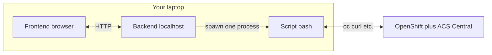

# PROJECT_PLAN — ACS demo modular setup + localhost GUI

**Status:** v1 GUI + demo modules **1–5** usable locally; **Splunk (6)** still deferred; **Central bootstrap (`install-central`)** complete; **`install-secured-cluster`** implements **CRS → Secret → SecuredCluster CR** (validate in lab). See §8.  
**Working folder:** `~/code/ACS playground/demo-setup-GUI/`  
**RHACS documentation baseline:** **4.10** — https://docs.redhat.com/en/documentation/red_hat_advanced_cluster_security_for_kubernetes/4.10 (detail links in skill **`REFERENCE.md`**).  
**Script — implementation (only place):** `~/.cursor/skills/acs-demo-setup/scripts/acs-demo-setup.sh` (YAML defaults beside it: `central-cr-minimal.yaml`, `secured-cluster-cr-minimal.yaml`). **`demo-setup-GUI`** does **not** carry a copy — GUI spawns that path (or **`ACS_DEMO_SETUP_SCRIPT`**). Skill backup = your skills repo / workflow, not this folder.  
**Source of truth for behavior:** `acs-demo-setup.sh` only. This doc: **§2** maps demo module **#** + ID → script ( **`1`–`8`** ), plus **bootstrap `--module` names** for RHACS install; **§3** diagram + vocabulary; staged plan; no duplicated install procedure.  
**Principle:** All work in chat aligns with this document; the agent **appends §8** after every **significant** action (see §8). Log **When** column uses local **`YYYY-MM-DD HH:MM:SS`**.

---

## 1. Objectives

1. **Modular installation** — choose which parts to run or refresh. **Demo module numbers and IDs** are fixed in **§2** (`1` … `8`). **1–5** are **v1** (implemented in `acs-demo-setup.sh`). **6** (Splunk) is **deferred**. **7–8** map to RHACS **bootstrap CLI modules** **`install-central`** (complete) and **`install-secured-cluster`** (in progress — operator **SecuredCluster CR / CRS**, not legacy init-bundle). Behavior lives **only** in the script; **§2** maps numbers + IDs + bootstrap flags (no duplicated procedure).

2. **Default behavior** — No module flags ⇒ **same end state** as today’s monolithic script. **Full-install sequence** is **§2** (below); orchestration may **resequence** relative to legacy **line order** (today’s script runs ACS scope/roles **before** heading **`6)`** OpenShift auth provider; modular order runs module **4** before module **5**’s work — see §2).

3. **GUI (later stages)** — localhost HTML/JS UI plus a small backend:
   - pick modules  
   - show **per-module status** (absent / partial / ready + short, non-secret detail)  
   - show **live script output**  
   - show **structured progress** (not only raw log scraping)  

4. **Risk control** — small stages, each **tested and signed off** before the next; ability to pause indefinitely using this doc and the Progress log.

---

## 2. Modules ↔ `acs-demo-setup.sh`

**Preflight** (`0) Preconditions`) runs before installs; it is **not** a numbered module.

Headings below match the script’s numbered section comments (e.g. `# -----------------------------------------------------------------------------` / `==>` blocks).

| # | Module ID | Script / notes |
|---|-----------|----------------|
| **1** | **ms-demo** | `1) Namespace + demo workload` — **Stage 1:** only **`DEMO_NAMESPACE`** + manifest apply; **`CHRIS_OCP_NAMESPACES`** creation moves to **module 3**. |
| **2** | **registries** | `2) ACS registry integration` |
| **3** | **OCP users** | `3) OpenShift HTPasswd IdP + adam/boaz/chris + RBAC` — plus **`CHRIS_OCP_NAMESPACES`** split out of §1 |
| **4** | **OCP-OAuth** | `6) OpenShift OAuth auth provider on Central` |
| **5** | **ACS users** | `4–5) ACS access scope + role` and `7) Group rules` |
| **6** | **Splunk** | *(deferred)* — Splunk demo skill / scripts; **Stage 6**. Not in `acs-demo-setup.sh` today. |
| **7** | **Central** | **CLI:** `--module install-central` — **complete**. Applies **Central** custom resource via **`CENTRAL_CR_MANIFEST`** (default **`central-cr-minimal.yaml`** next to `acs-demo-setup.sh` in the skill directory). RHACS operator must already be installed. Idempotent noop if a Central CR already exists in `stackrox`. |
| **8** | **Secured cluster** | **CLI:** `--module install-secured-cluster` — **CRS + CR path coded** (**lab validation** pending). After Central **Available**: **`POST /v1/cluster-init/crs`** (unless **`cluster-registration-secret`** exists), apply CRS YAML, then **SecuredCluster** CR via **`SECURED_CLUSTER_CR_MANIFEST`** (default **`secured-cluster-cr-minimal.yaml`** beside the script in the skill dir). Env **`CRS_GENERATION_NAME`** (default **`acs-demo-setup-crs`**). |

**Bootstrap sequence (greenfield, when both selected):** **`install-central` → `install-secured-cluster` →** demo modules **1 → 2 → 3 → 4 → 5** (canonical order in script).

**Dependency:** **5** runs only after **4** (orchestrator / `--status`).

**Full default install order (v1, Central already exists):** preflight → **1 → 2 → 3 → 4 → 5**. In-file, §4–5 appear before §6; modular runs run **4** before **5**’s bundle — same operations, different sequence.

**Deferred:** **6** via Stage 6. **7** complete (CLI); **8** CRS+CR flow implemented — **lab validation** pending.

---

## 3. Architecture & vocabulary

Words we use the same way:

| Term | What it is |
|------|------------|
| **Script** | `acs-demo-setup.sh` — does real work (`oc`, `curl`, Central API). Gets modular install flags and, later, a **`--status`** (or equivalent) **check-only** mode. |
| **Backend** | Tiny web server on **`127.0.0.1`** only (Python or Node — pick later). **Not** bash. It **starts** the script and **pipes** stdout/stderr back to the UI. |
| **Frontend / UI** | HTML + JS in the browser: toggles, logs. **No** cluster access by itself. |
| **Manifest** | JSON describing **which rows** the UI shows and **which script args** each row implies (see §4). |



Plain picture if Mermaid does not render:

```
  Browser (UI) ----HTTP----> Backend (127.0.0.1)
                                   |
                                   └── runs ----> acs-demo-setup.sh ----> cluster / Central
```

---

## 4. Constraints and security

- **Secrets:** Do not commit `ACS_ADMIN_PASSWORD`, kubeconfigs, or generated user passwords. Env-based injection only; consider log redaction in a hardening stage.  
- **Browser:** The UI does not get direct OS access; a **127.0.0.1** server runs the script and streams output.  
- **Concurrency:** At most **one** install run at a time (queue or HTTP 409) to avoid overlapping `oc` / `roxctl`.  
- **Skill vs GUI:** **Implementation** = Cursor **skill** only (`acs-demo-setup.sh` + YAMLs). **`demo-setup-GUI`** = **orchestrator only** (Flask + static UI). **`run-gui.sh` / Flask** default to the **skill** path; set **`ACS_DEMO_SETUP_SCRIPT`** if the script lives elsewhere.

### Design guidelines — GUI module manifest

- **Catalog = JSON:** Checkbox/table rows come from a **manifest file** the backend serves; changing JSON + refresh updates options **without rebuilding** the UI bundle (unless presentation logic changes).
- **Mapping to execution:** Each entry declares how it contributes to one script invocation (e.g. flags, env keys, or ordered module tokens). The backend **aggregates** selected entries into argv/env using **§2** order and **Dependency** rules—not ad hoc string concat from the browser.
- **Trust boundary:** Validate manifest entries and user selections against an **allowlist** of known module IDs / fragments; never execute unchecked strings from the client or file as shell.

---

## 5. Staged plan (order matters)

Each stage has **deliverables**, **proof** (exit criteria), and **do not proceed** until proof is satisfied.

### Stage 0 — Scope freeze

**Deliverable:** Modules **1–5** frozen as in **§2**; **6–8** listed as deferred only.

**Proof:** User says go, or latest §8 entry records Stage 0 scope frozen.

**Stop gate:** No bash refactor before that.

---

### Stage 1 — Modularize bash only (no server, no GUI)

**Deliverable:**  
- Script refactored into **named modules** aligned with **§2** table (functions or sourced fragments), **full default install order** per §2 when all selected.  
- Explicit selection via flags or env (exact spelling TBD), e.g. `--module X` or `ACS_DEMO_MODULES=...`.  
- **`No args` / default:** end-state parity with today’s monolithic script (see §2 split note for **1** / **3**).  
- **5** only after **4** (§2 **Dependency**).

**Proof:**  
- Full default run matches pre-refactor cluster + Central configuration (validate against **`acs-demo-setup.sh`** intent section-by-section).  
- Single-module runs idempotent; partial runs honor §2 **Dependency** (blocked/partial **5** without **4**).

**Stop gate:** No backend work until Stage 1 proof is recorded.

---

### Stage 2 — Per-option “already installed?” checks

**Deliverable:** Something callable (e.g. script **`--status`**) that answers **done / not done / stuck** per module **1–5** so the GUI can label rows. Example: **5** incomplete until **4** exists → **blocked**, not green. (**6–8** when they exist.)

**Proof:** Spot-check a couple of modules against what you see in OpenShift/ACS; labels aren’t nonsense.

**Stop gate:** Don’t rely on the GUI for truth until this exists (or you accept no per-row status at first).

---

### Stage 3 — Minimal localhost backend (no HTML)

**Deliverable:**  
- Server on loopback only: `GET /health`, `GET /api/status` (shell out to status), `POST /api/run` with `{ "modules": [...] }`, stream stdout/stderr (SSE or WebSocket).

**Proof:**  
- Scripted `curl` (or equivalent): run completes, stream observed, exit code exposed.  
- Confirm bind address is localhost-only if required.

**Stop gate:** No full GUI until Stage 3 passes.

---

### Stage 4 — HTML UI v0

**Deliverable:**  
- Static UI: module toggles driven by **manifest JSON** (§4), Run, Refresh status, log pane from stream.

**Proof:**  
- End-to-end module run from browser only; status matches Stage 2 after run.

---

### Stage 5 — Structured progress

**Deliverable:**  
- Script emits stable **progress lines** (e.g. prefixed token + key=value or JSON); backend parses and exposes to UI (fields or secondary SSE).

**Proof:**  
- Failure mid-run shows failed state + logs; reconnect behavior defined and tested once.

---

### Stage 6 — Module **6** (Splunk)

**Deliverable:**  
- Wrapper for **module 6** calling the Splunk skill scripts; same run/status contract as other modules; `blocked_reason` when prereqs missing.

**Proof:**  
- Exercise **6** off/on against a lab stack; **append §8** with outcome / next.

---

### Stage 7 — Hardening

**Deliverable:**  
- Timeouts, log size cap in UI, redaction hooks, clearer errors; optional token if API ever leaves strict localhost.

**Proof:**  
- Short manual test list (wrong cluster context, stale kubeconfig) with expected UI behavior.

---

### Stage 8 — Modules **7–8** (Central, Secured cluster)

**Deliverable:**  
- **`install-central` — done:** CR apply path documented in **§2**; manifests beside the script in the **skill** directory.  
- **`install-secured-cluster` — CRS + CR apply implemented** in script (Central API CRS, Secret apply, SecuredCluster CR); **lab proof** still required. Later: GUI **run** wiring; **`--status`** already surfaces registration row.

**Proof:** §8 entries record bootstrap milestones (central complete → secured-cluster CRS validated).

---

## 6. Pause / resume protocol

1. **Agent (ongoing):** **append §8** after each **significant** step — not only when pausing (see §8). Use **one row** per step with timestamp **`YYYY-MM-DD HH:MM:SS`** (local).  
2. **Agent (resume):** read **§8** from the **bottom up** for the latest done / **next** action; use **§5** for stage detail.

---

## 7. Files in this repo (evolving)

| Path | Purpose |
|------|--------|
| `README.md` | Pointers + **how to run the GUI** |
| `docs/PROJECT_PLAN.md` | This plan + Progress log |
| `run-gui.sh` | Starts Flask UI (`server/app.py`) using `server/.venv` |
| `server/app.py` | `127.0.0.1` API + static `web/` |
| `server/requirements.txt` | Python deps (Flask) |
| `server/.venv/` | Local venv (gitignored); create with `python3 -m venv server/.venv` + pip install |
| `web/` | `index.html`, `app.js`, `demo-setup.css` (PF tokens + layout; PF core from CDN) |
| `config/modules.json` | GUI module catalog |

---

## 8. Progress log *(append after every significant action)*

**Agent:** After each **significant** step, **add one row** (newest at bottom). **When** column = local clock **`YYYY-MM-DD HH:MM:SS`**. One line *What happened*; optional *Next*.

**Resume:** Read from the **bottom** — last row(s) carry current state and **next** action.

| When (local) | What happened | Next (if any) |
|----------------|---------------|----------------|
| 2026-05-05 23:18:09 | **Stages 1–4** done: modular **`acs-demo-setup.sh`** (flags **1→5**), **`--status`** + preflight (+ **`ensure_acs_central_url`** when only **`ROX_ENDPOINT`** / **`~/.roxctl/set-env.sh`**); Flask **`server/app.py`**; GUI **`web/`** + **`config/modules.json`**, **`run-gui.sh`**, PatternFly (wide column, module rows, status/collapsibles). §8 **pruned**; log **When** = **`YYYY-MM-DD HH:MM:SS`** (local). | **Stage 5** (structured progress) optional. |
| 2026-05-05 23:37:07 | **Checkpoint — phase complete:** **`modules.json`** catalogs **1–8** ( **`ocp-oauth`** slug for script; label shows **ocp-OAuth** ); deferred rows **6–8** visible in UI; **`POST /api/run`** returns **501** if **splunk** / **central** / **secured-cluster** selected until implemented. Repo backed up on GitHub (**`boazmichaely/acs-playground`**). | **Next:** **Splunk** (**module 6**) — wire Splunk skill/scripts into run/status; then **Central** (**7**) + **secured cluster** (**8**) per Stage 8 mini-plan. |
| 2026-05-07 15:49:03 | **`install-central` complete** (CLI **`--module install-central`** — Central CR apply path). **`acs-demo-setup.sh`** + **`central-cr-minimal.yaml`** + **`secured-cluster-cr-minimal.yaml`** copied into **`demo-setup-GUI/scripts/`** and committed — **canonical GitHub backup** per project guidance; **`PROJECT_PLAN`** §2 / Stage 8 / §7 updated. **`install-secured-cluster` mid-way:** validate **operator SecuredCluster CR (CRS)** flow; earlier **init-bundle**-oriented code may need **redo/removal**. GUI still **501** for central/secured-cluster **run** until wired. | **Next:** code + test **`install-secured-cluster`** (CRS), sync skill mirror if desired, then GUI run wiring when ready. |
| 2026-05-07 16:57:20 | **Roles clarified:** **`demo-setup-GUI`** = orchestrator only (Flask + UI spawning bash). **Skill** `~/.cursor/skills/acs-demo-setup/scripts/acs-demo-setup.sh` = **implementation** (iterate here first). **`demo-setup-GUI/scripts/`** = **GitHub backup** (copy skill → repo to push). Docs + **`run-gui.sh`** + Flask **`default_script_path`** updated to **prefer skill** by default. | **Next:** continue **`install-secured-cluster`** coding/tests on skill script; refresh repo **`scripts/`** when backing up. |
| 2026-05-11 12:00:00 | **`install-secured-cluster`:** after Central **Available**, script now generates CRS via **`POST /v1/cluster-init/crs`** (unless Secret **`cluster-registration-secret`** already exists in **`stackrox`** / **`STACKROX_NAMESPACE`**), **`oc apply`** CRS YAML, then applies **SecuredCluster** CR; env **`CRS_GENERATION_NAME`** (default **`acs-demo-setup-crs`**). **`--status`** resolver honors **`ACS_SECURED_CLUSTER_NAME`**. Skill script synced to **`demo-setup-GUI/scripts/acs-demo-setup.sh`**. | **Next:** lab validate on live Central 4.10; GUI **501** removal for secured-cluster **run** when ready. |
| 2026-05-11 18:00:00 | **Removed `demo-setup-GUI/scripts/`** duplicate (`acs-demo-setup.sh`, CR YAMLs). Implementation stays **skill-only**; GUI **`run-gui.sh`** / **`server/app.py`** use skill path or **`ACS_DEMO_SETUP_SCRIPT`**. Docs (**§1 header, §4, §7, §2 paths**) updated — no second copy in this repo. | |

---

## 9. Agent checklist *(before Stage 1 implementation)*

Use **§2** vocabulary (**modules 1–8**). Do not edit `acs-demo-setup.sh` until:

- [ ] User has confirmed §2 **numbered modules** + **Stage 1 split** (**CHRIS_OCP_NAMESPACES** under **3**) — or noted exceptions in §8.  
- [ ] User has confirmed §3 **architecture** (browser → backend → script) — or noted exceptions in §8.  
- [ ] User has confirmed §2 **full default order** (**1→5**) and **legacy script order vs modular order** (module **4** before **5**) — or noted exceptions in §8.  
- [ ] User has confirmed **Stages 0–8** are acceptable — or listed deltas in §8.  
- [ ] User has confirmed **default full install** = today’s monolithic end state — or documented delta in §8.  
- [ ] Paths are clear: script path in **this doc header** + `README.md`; plans in `demo-setup-GUI/`.  
- [ ] **§8:** agent appends after **every significant action**, not only on pause — with **`YYYY-MM-DD HH:MM:SS`** (local) in **When**.

*If anything is unclear, ask the user once; log outcomes and decisions in §8 when they matter for continuation.*
